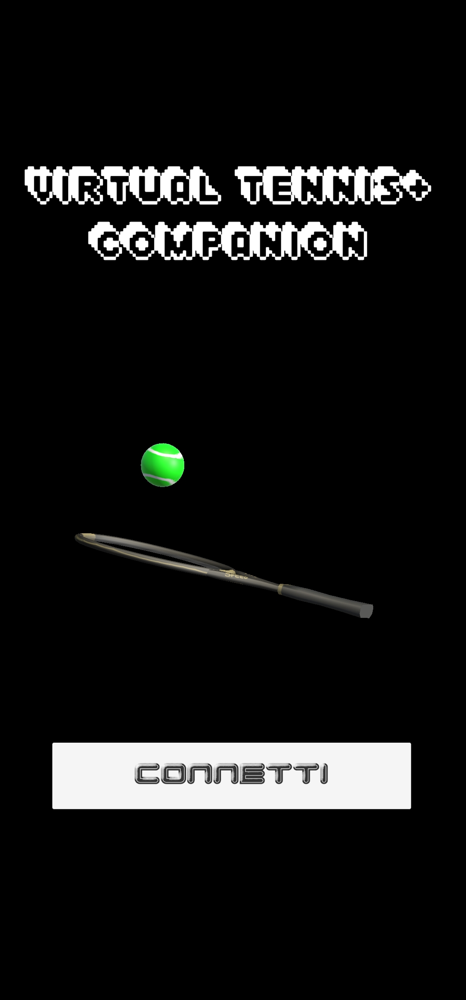
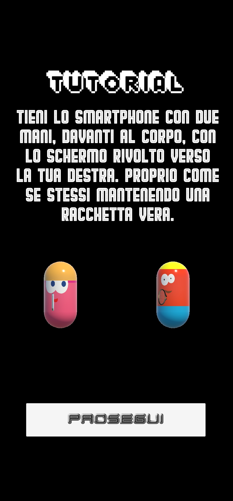
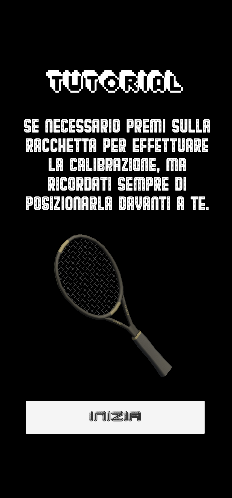
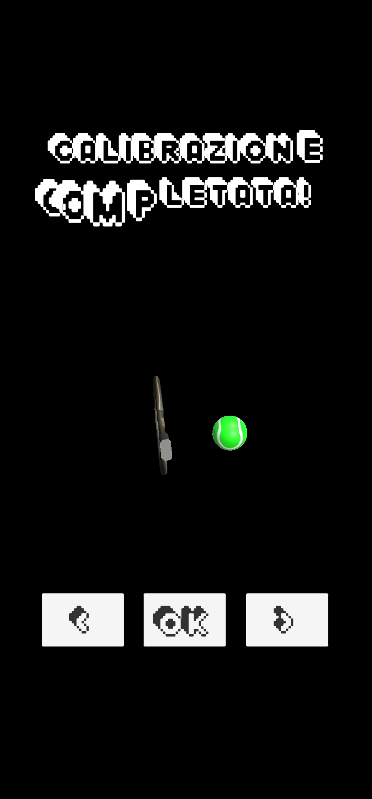
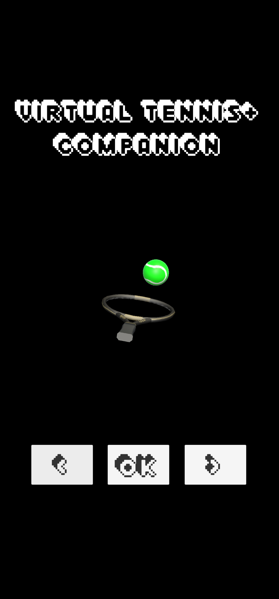
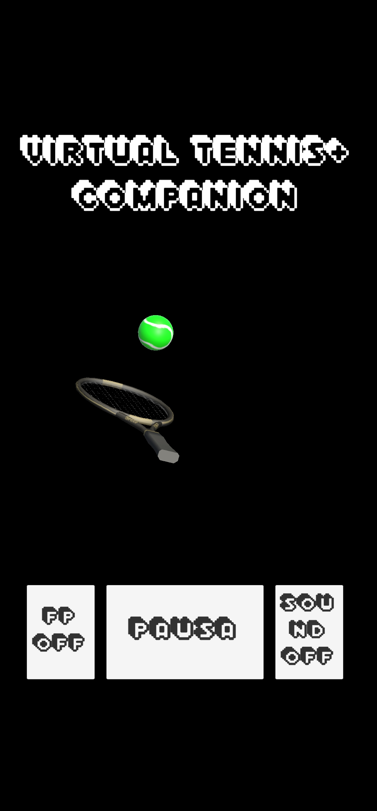

# Virtual Tennis+ Companion

The Virtual Tennis+ Companion is a mobile application designed to enhance and control the Virtual Tennis+ VR game.  
It connects to the game via TCP/IP and uses the phone’s sensors for gesture-based shot control, providing a more immersive and natural gameplay experience.

---

## 📱 Features
- **Gesture Recognition** using gyroscope data for:
  - **Strong vs. Weak Shots** – Determined by swing speed.
  - **Serving Gestures** – Detected through a two-phase process (preparation + execution).
- **In-game Controls**:
  - Navigate menus.
  - Pause/resume matches.
  - Switch between first- and third-person views.
  - Mute/unmute background music.
- **Interactive Feedback**:
  - Animated effects for swings, victories, and defeats.
  - Lighting effects for trophies and celebrations.

---

## 🛠 Technical Details
- **Connection Workflow**:
  1. Sends a UDP broadcast to discover the game server.
  2. Establishes a TCP/IP connection for gameplay control.
  3. Sends regular pings to ensure connection stability, with automatic disconnect/reconnect handling.
- **Main Classes**:
  - `Tutorial` – Guides the player through calibration and controls.
  - `GestioneSensori` – Handles sensor data, gesture recognition, and network communication.
- **Thread & Queue System**:
  - Actions received from the game are queued and executed in the main thread to avoid race conditions.

---

## 🏓 Gesture Detection Process
1. **Serve Preparation** – Detects lateral movements and filters irrelevant motion.
2. **Swing Recognition** – Measures angular velocity and swing amplitude, triggering the corresponding shot in the game.

---

## 📸 Screenshots

### App Main Interface

### Calibration Tutorial

### Menu Navigation

### Gameplay Controls

### Trophy Celebration & Effects

---
